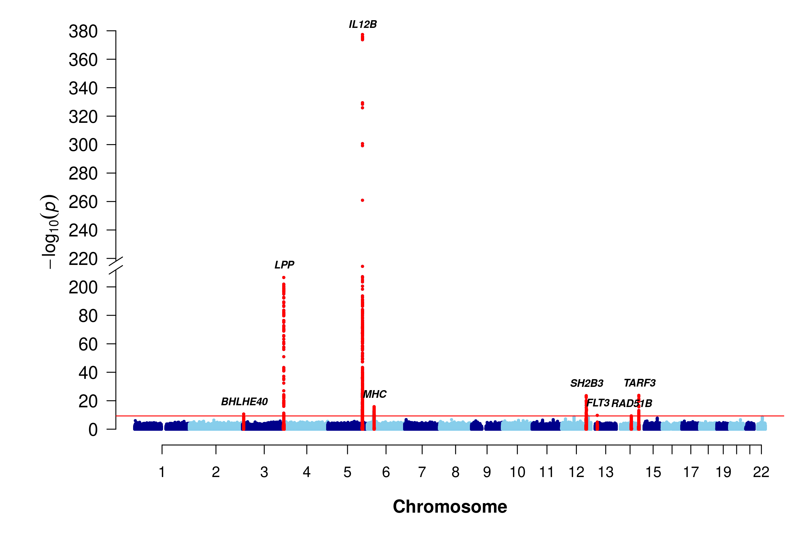
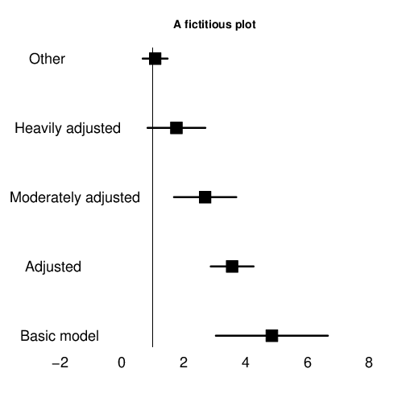

```{r setup, include=FALSE}
set.seed(0)
options(rmarkdown.html_vignette.check_title = FALSE)
knitr::opts_chunk$set(
  out.extra = 'style="display:block; margin: auto"',
  fig.align = "center",
  fig.path = "figures/",
  collapse = TRUE,
  comment = "#>",
  dev = "png")
```

Department of Public Health and Primary Care, University of Cambridge, Cambridge, UK 
https://jinghuazhao.github.io/

# Introduction

This package was initiated to integrate some C/Fortran/SAS programs I have written 
or used over the years. As such, it would rather be a long-term project, but an
immediate benefit would be something complementary to other packages currently
available from CRAN, e.g. **genetics**, **hwde**, etc. I hope eventually this will
be part of a bigger effort to fulfill most of the requirements foreseen by many, 
e.g. @guo00, within the portable environment of R for data management, 
analysis, graphics and object-oriented programming. My view has been outlined
more formally in @zt06a and @zt06b in relation to other package
systems. Also reported are @zhao05 and @zhao06 on package **kinship**.

The number of functions are quite limited and experimental, but I already feel
the enormous advantage by shifting to R and would like sooner rather than later
to share my work with others. I will not claim this work as exclusively done by
me, but would like to invite others to join me and enlarge the collections and
improve them.

With my recent work on genomewide association studies (GWAS) especially protein
GWAS, I have added many functions such as `METAL_forestplot` which handles
data from software METAL and `sentinels` which extracts sentinels from
GWAS summary statistics in a way that is very appealing to us compared to some
other established software. At the meantime, the size of the package surpasses
the limit as imposed by CRAN, thus the old good feature of `S` as with
`R` that value both code and data alike has to suffer slightly in that
`gap.datasets` and `gap.examples` are spun off as two separate
packages; they do deserve a glimpse however for some general ideas.

# Implementation

The following list shows the data and functions currently available.

Name              |      Description
------------------|------------------------------------------------------------------
**ANALYSIS** | &nbsp;
AE3               |      AE model using nuclear family trios
bt                |      Bradley-Terry model for contingency table
ccsize            |      Power and sample size for case-cohort design
cs                |      Credibel set
fbsize            |      Sample size for family-based linkage and association design
gc.em             |      Gene counting for haplotype analysis
gcontrol          |      genomic control
gcontrol2         |      genomic control based on p values
gcp               |      Permutation tests using GENECOUNTING
gc.lambda         |      Estionmation of the genomic control inflation statistic (lambda)
genecounting      |      Gene counting for haplotype analysis
gif               |      Kinship coefficient and genetic index of familiality
grmMCMC           |      Mixed modeling with genetic relationship matrices
gsmr              |      Mendelian randomization analysis
hap               |      Haplotype reconstruction
hap.em            |      Gene counting for haplotype analysis
hap.score         |      Score statistics for association of traits with haplotypes
htr               |      Haplotype trend regression
hwe               |      Hardy-Weinberg equilibrium test for a multiallelic marker
hwe.cc            |      A likelihood ratio test of population Hardy-Weinberg equilibrium
hwe.hardy         |      Hardy-Weinberg equilibrium test using MCMC
invnormal         |      Inverse normal transformation
kin.morgan        |      kinship matrix for simple pedigree
LD22              |      LD statistics for two diallelic markers
LDkl              |      LD statistics for two multiallelic markers
lambda1000        |      A standardized estimate of the genomic inflation scaling to
&nbsp;            |      a study of 1,000 cases and 1,000 controls
log10p            |      log10(p) for a standard normal deviate
log10pvalue       |      log10(p) for a P value including its scientific format
logp              |      log(p) for a normal deviate
masize            |      Sample size calculation for mediation analysis
mia               |      multiple imputation analysis for hap
mtdt              |      Transmission/disequilibrium test of a multiallelic marker
mtdt2             |      Transmission/disequilibrium test of a multiallelic marker
&nbsp;            |      by Bradley-Terry model
mvmeta            |      Multivariate meta-analysis based on generalized least squares
pbsize            |      Power for population-based association design
pbsize2           |      Power for case-control association design
pfc               |      Probability of familial clustering of disease
pfc.sim           |      Probability of familial clustering of disease
pgc               |      Preparing weight for GENECOUNTING
print.hap.score   |      Print a hap.score object
s2k               |      Statistics for 2 by K table
sentinels         |      Sentinel identification from GWAS summary statistics
tscc              |      Power calculation for two-stage case-control design
&nbsp; | &nbsp;
**GRAPHICS** | &nbsp;
asplot            |      Regional association plot
ESplot            |      Effect-size plot
circos.cnvplot    |      circos plot of CNVs
circos.cis.vs.trans.plot | circos plot of cis/trans classification
circos.mhtplot    |      circos Manhattan plot with gene annotation
cnvplot           |      genomewide plot of CNVs
METAL\_forestplot |      forest plot as R/meta's forest for METAL outputs
makeRLEplot       |      make relative log expression plot
mhtplot           |      Manhattan plot
mhtplot2          |      Manhattan plot with annotations
mhtplot2d         |      2D Manhattan plot
mhtplot3d         |      3D Manhattan plot
mhtplot.trunc     |      truncated Manhattan plot
miamiplot         |      Miami plot
pedtodot          |      Converting pedigree(s) to dot file(s)
plot.hap.score    |      Plot haplotype frequencies versus haplotype score statistics
qqfun             |      Quantile-comparison plots
qqunif            |      Q-Q plot for uniformly distributed random variable
&nbsp; | &nbsp;
**UTILITIES** | &nbsp;
SNP               |      Functions for single nucleotide polymorphisms (SNPs)
BFDP              |      Bayesian false-discovery probability
FPRP              |      False-positive report probability
ab                |      Test/Power calculation for mediating effect
b2r               |      Obtain correlation coefficients and their variance-covariances
chow.test         |      Chow's test for heterogeneity in two regressions
chr\_pos\_a1\_a2  |      Form SNPID from chromosome, posistion and alleles
cis.vs.trans.classification | a cis/trans classifier
comp.score        |      score statistics for testing genetic linkage of quantitative trait
GRM functions     |      ReadGRM, ReadGRMBin, ReadGRMPLINK,
&nbsp;            |      ReadGRMPCA, WriteGRM,
&nbsp;            |      WriteGRMBin, WriteGRMSAS
&nbsp;            |      handle genomic relationship matrix involving other software
heritability functions | h2G, VR, h2GC, h2l give point estimates as with their variances
&nbsp;                 | for continuous traits and binary traits under liability threshold
&nbsp;                 | model and case-control sampling
h2                |      Heritability estimation according to twin correlations
&nbsp;            |      for case-control studies
klem              |      Haplotype frequency estimation based on a genotype table
&nbsp;            |      of two multiallelic markers
makeped           |      A function to prepare pedigrees in post-MAKEPED format
metap             |      Meta-analysis of p values
metareg           |      Fixed and random effects model for meta-analysis
muvar             |      Means and variances under 1- and 2- locus (diallelic) QTL model
pvalue            |      P value for a normal deviate
read.ms.output    |      A utility function to read ms output
snptest\_sample   |      A utility to generate SNPTEST sample file
twinan90          |      Classic twin models
whscore           |      Whittemore-Halpern scores for allele-sharing
weighted.median   |      Weighted median with interpolation

Assuming proper installation, you will be able to obtain the list by typing
`library(help=gap)` or view the list within a web browser via 
`help.start()`. See Appendix on how to obtain a full list of functions.

A PDF version of this file can be viewed with command `vignette("gap", package="gap")`.

You can cut and paste examples at end of each function's documentation.

Both `genecounting` and `hap` are able to handle SNPs and multiallelic
markers, with the former be flexible enough to include features such as X-linked data
and the later being able to handle large number of SNPs. But they are unable to
recode allele labels automatically, so functions `gc.em` and `hap.em`
are in `haplo.em` format and used by a modified function `hap.score` in
association testing.

It is notable that multilocus data are handled differently from that in **hwde** and
elegant definitions of basic genetic data can be found in the **genetics** package.

Incidentally, I found my C mixed-radixed sorting routine as in @zhao03 is much
faster than R's internal function.

With exceptions such as function `pfc` which is very computer-intensive, most
functions in the package can easily be adapted for analysis of large datasets involving
either SNPs or multiallelic markers. Some are utility functions, e.g. `muvar`
and `whscore`, which will be part of the other analysis routines in the future.

The benefit with R compared to standalone programs is that for users, all functions have
unified format. For developers, it is able to incorporate their C/C++ programs more
easily and avoid repetitive work such as preparing own routines for matrix algebra and
linear models. Further advantage can be taken from packages in **Bioconductor**, which
are designed and written to deal with large number of genes.

# Independent programs

To facilitate comparisons and individual preferences, The source codes for 2LD, EHPLUS, 
GENECOUNTING, HAP, now hosted at GitHub, have enjoyed great popularity ahead of the
genomewide association studies (GWAS) therefore are likely to be more familiar than their
R couunterparts in `gap`. However, you need to follow their instructions to compile
for a particular computer system.

I have included {ms} code (which is required by `read.ms.output` and .xls files
to accompany `read.ms.output` and `FPRP` and `BFDP` functions as with a 
classic twin example for ACE model in **OpenMx**. The package is now available from
CRAN.

For these models it is actually simpler to use facilities as in package **mets**, which I
now suggest.

A final category is `twinan90`, which is now dropped from the package function list
due to difficulty to keep up with the requirements by the `R` environment but 
nevertheless you will still be able to compile and use otherwise.

# Demos

You can also try several simple examples via `demo`:

```r
library(gap)
demo(gap)
```

# Examples

I would like to highlight `pedtodot`, `pbsize`, `fbsize` and `ccsize` functions
used for pedigree drawing and power/sample calculations in a genome-wide asssociatoin study as
reported in @zhao07.

## Pedigree drawing

I have included the original file for the *R News* as well as put examples in separate 
vignettes. They can be accessed via `vignette("rnews",package="gap.examples")` and 
`vignette("pedtodot", package="gap.examples")`, respectively.

## Kinship calculation

Next, I will provide an example for kinship calculation using `kin.morgan`.
It is recommended that individuals in a pedigree are ordered so that parents
always precede their children. In this regard, package **pedigree** can be
used, and package **kinship2** can be used to produce pedigree diagram as with
kinship matrix.

### Pedigree diagram

The pedigree diagram is as follows,

```{r lukas, fig.height=8, fig.width=7}
library(gap)
# pedigree diagram
data(lukas)
library(kinship2)
ped <- with(lukas,pedigree(id,father,mother,sex))
plot(ped,cex=0.4)
```

### Kinship calculation

We then turn to the kinship calculation.

```{r}
# unordered individuals
library(gap)
gk1 <- kin.morgan(lukas)
write.table(gk1$kin.matrix,"results/gap_1.txt",quote=FALSE)

library(kinship2)
kk1 <- kinship(lukas[,1],lukas[,2],lukas[,3])
write.table(kk1,"results/kinship_1.txt",quote=FALSE)

d <- gk1$kin.matrix-kk1
sum(abs(d))

# order individuals so that parents precede their children
library(pedigree)
op <- orderPed(lukas)
olukas <- lukas[order(op),]
gk2 <- kin.morgan(olukas)

write.table(olukas,"olukas.csv",quote=FALSE)
write.table(gk2$kin.matrix,"results/gap_2.txt",quote=FALSE)

kk2 <- kinship(olukas[,1],olukas[,2],olukas[,3])
write.table(kk2,"results/kinship_2.txt",quote=FALSE)

z <- gk2$kin.matrix-kk2
sum(abs(z))
```

We see that in the second case, the result agrees with **kinship2**.

## Study design

### Family-based design

The example involving family-based design is as follows,

```{r}
library(gap)
models <- matrix(c(
         4.0, 0.01,
         4.0, 0.10,
         4.0, 0.50, 
         4.0, 0.80,
         2.0, 0.01,
         2.0, 0.10,
         2.0, 0.50,
         2.0, 0.80,
         1.5, 0.01,    
         1.5, 0.10,
         1.5, 0.50,
         1.5, 0.80), ncol=2, byrow=TRUE)
outfile <- "fbsize.txt"
cat("gamma","p","Y","N_asp","P_A","H1","N_tdt","H2","N_asp/tdt",
    "L_o","L_s\n",file=outfile,sep="\t")
for(i in 1:12) {
    g <- models[i,1]
    p <- models[i,2]
    z <- fbsize(g,p)
    cat(z$gamma,z$p,z$y,z$n1,z$pA,z$h1,z$n2,z$h2,z$n3,
        z$lambdao,z$lambdas,file=outfile,append=TRUE,sep="\t")
    cat("\n",file=outfile,append=TRUE)
}
table1 <- read.table(outfile,header=TRUE,sep="\t")
nc <- c(4,7,9)
table1[,nc] <- ceiling(table1[,nc])
dc <- c(3,5,6,8,10,11)
table1[,dc] <- round(table1[,dc],2)
unlink(outfile)
# APOE-4, Scott WK, Pericak-Vance, MA & Haines JL
# Genetic analysis of complex diseases 1327
g <- 4.5
p <- 0.15
cat("\nAlzheimer's:\n\n")
fbsize(g,p)
table1
```

### Population-based design

The example involving population-based design is as follows,

```{r}
library(gap)
kp <- c(0.01,0.05,0.10,0.2)
models <- matrix(c(
          4.0, 0.01,
          4.0, 0.10,
          4.0, 0.50, 
          4.0, 0.80,
          2.0, 0.01,
          2.0, 0.10,
          2.0, 0.50,
          2.0, 0.80,
          1.5, 0.01,    
          1.5, 0.10,
          1.5, 0.50,
          1.5, 0.80), ncol=2, byrow=TRUE)
outfile <- "pbsize.txt"
cat("gamma","p","p1","p5","p10","p20\n",sep="\t",file=outfile)
for(i in 1:dim(models)[1])
{
   g <- models[i,1]
   p <- models[i,2]
   n <- vector()
   for(k in kp) n <- c(n,ceiling(pbsize(k,g,p)))
   cat(models[i,1:2],n,sep="\t",file=outfile,append=TRUE)
   cat("\n",file=outfile,append=TRUE)
} 
table5 <- read.table(outfile,header=TRUE,sep="\t")
table5
```

### Case-cohort design

For case-cohort design, we obtain results for ARIC and EPIC studies.

```{r}
library(gap)
# ARIC study
outfile <- "aric.txt"
n <- 15792
pD <- 0.03
p1 <- 0.25
alpha <- 0.05
theta <- c(1.35,1.40,1.45)
beta1 <- 0.8
s_nb <- c(1463,722,468)
cat("n","pD","p1","hr","q","power","ssize\n",file=outfile,sep="\t")
for(i in 1:3)
{
  q <- s_nb[i]/n
  power <- ccsize(n,q,pD,p1,alpha,log(theta[i]))
  ssize <- ccsize(n,q,pD,p1,alpha,log(theta[i]),beta1)
  cat(n,"\t",pD,"\t",p1,"\t",theta[i],"\t",q,"\t",
      signif(power,3),"\t",ssize,"\n",
      file=outfile,append=TRUE)
}
read.table(outfile,header=TRUE,sep="\t")
unlink(outfile)
# EPIC study
outfile <- "epic.txt"
n <- 25000
alpha <- 0.00000005
power <- 0.8
s_pD <- c(0.3,0.2,0.1,0.05)
s_p1 <- seq(0.1,0.5,by=0.1)
s_hr <- seq(1.1,1.4,by=0.1)
cat("n","pD","p1","hr","alpha","ssize\n",file=outfile,sep="\t")
# direct calculation
for(pD in s_pD)
{
   for(p1 in s_p1)
   {
      for(hr in s_hr)
      {
         ssize <- ccsize(n,q,pD,p1,alpha,log(hr),power)
         if (ssize>0) cat(n,"\t",pD,"\t",p1,"\t",hr,"\t",alpha,"\t",
                          ssize,"\n",
                          file=outfile,append=TRUE)
      }
   }
}
read.table(outfile,header=TRUE,sep="\t")
unlink(outfile)
```

## Graphics examples

I now include some figures from the documentation that may be of interest.

### Genome-wide association

The following code is used to obtain a Q-Q plot via `qqunif` function,

```{r qq, fig.height=7, fig.width=7}
library(gap)
u_obs <- runif(1000)
r <- qqunif(u_obs,pch=21,bg="blue",bty="n")
u_exp <- r$y
hits <- u_exp >= 2.30103
points(r$x[hits],u_exp[hits],pch=21,bg="green")
legend("topleft",sprintf("GC.lambda=%.4f",gc.lambda(u_obs)))
```

Based on a chicken genome scan data, the code below generates a Manhattan plot, demonstrating
the use of gaps to separate chromosomes.

```{r chicken, fig.with=7, fig.width=7, results="hide"}
library(gap.datasets)
ord <- with(w4,order(chr,pos))
w4 <- w4[ord,]
oldpar <- par()
par(cex=0.6)
colors <- c(rep(c("blue","red"),15),"red")
mhtplot(w4,control=mht.control(colors=colors,gap=1000),pch=19,srt=0)
axis(2,cex.axis=2)
suggestiveline <- -log10(3.60036E-05)
genomewideline <- -log10(1.8E-06)
abline(h=suggestiveline, col="blue")
abline(h=genomewideline, col="green")
abline(h=0)
```

The code below obtains a Manhattan plot with gene annotation,

```{r mhtplot, fig.height=7, fig.width=7, messages=FALSE, results="hide"}
data <- with(mhtdata,cbind(chr,pos,p))
glist <- c("IRS1","SPRY2","FTO","GRIK3","SNED1","HTR1A","MARCH3","WISP3",
           "PPP1R3B","RP1L1","FDFT1","SLC39A14","GFRA1","MC4R")
hdata <- subset(mhtdata,gene%in%glist)[c("chr","pos","p","gene")]
color <- rep(c("lightgray","gray"),11)
glen <- length(glist)
hcolor <- rep("red",glen)  
par(las=2, xpd=TRUE, cex.axis=1.8, cex=0.4)
ops <- mht.control(colors=color,yline=1.5,xline=3)
hops <- hmht.control(data=hdata,colors=hcolor)
mhtplot(data,ops,hops,pch=19)
axis(2,pos=2,at=1:16,cex.axis=0.5)
title("Manhattan plot with genes highlighted",cex.main=1)
```

All these look familiar, so revised form of the function called `mhtplot2` was
created for additional features such as centering the chromosome ticks, allowing for 
more sophisticated coloring schemes, using prespecified fonts, etc. Please refer to
the function's documentation example.

We could also go further with a circos Manhattan plot,

```{r circos, fig.height=7, fig.width=8}
circos.mhtplot(mhtdata, glist)
```

We now experiment with Miami plot,

```{r miami, fig.height=7, fig.width=7}
mhtdata <- within(mhtdata,{pr=p})
miamiplot(mhtdata,chr="chr",bp="pos",p="p",pr="pr",snp="rsn")
```

We now illustrate with a truncated Manhattan plot,

```r
par(oma=c(0,0,0,0), mar=c(5,6.5,1,1))
mhtplot.trunc(IL.12B, chr="Chromosome", bp="Position", z="Z",
   snp="MarkerName",
   suggestiveline=FALSE, genomewideline=-log10(5e-10),
   cex.mtext=1.2, cex.text=0.7,
   annotatelog10P=-log10(5e-10), annotateTop = FALSE,
   highlight=with(genes,gene),
   mtext.line=3, y.brk1=115, y.brk2=200, delta=0.01,
   cex.axis=1.2, cex.y=1.2, cex=0.5, font=2, font.axis=1,
   y.ax.space=20,
   col = c("blue4", "skyblue")
)
```

```{r il12b, crop=NULL, echo=FALSE, fig.height=7, fig.width=8}

```

The code below obtains a regional association plot with the `asplot` function,

```{r asplot, fig.height=7, fig.width=7}
asplot(CDKNlocus, CDKNmap, CDKNgenes, best.pval=5.4e-8, sf=c(3,6))
title("CDKN2A/CDKN2B Region")
```

The function predates the currently popular **locuszoom** software but leaves
the option open for generating such plots on the fly and locally.

Note that all these can serve as templates to customize features of your own.

### Copy number variation

A plot of copy number variation (CNV) is shown here,

```{r cnv, fig.height=7, fig.width=7}
cnvplot(cnv)
```

### Effect size plot

The code below obtains an effect size plot via the `ESplot` function.

```r
library(gap)
options(stringsAsFactors=FALSE)
testdata <- data.frame(models=c("Basic model","Adjusted",
                       "Moderately adjusted",
                       "Heavily adjusted","Other"),
OR = c(4.5,3.5,2.5,1.5,1),
SElogOR = c(0.2,0.1,0.5,0.5,0.2))
ESplot(testdata,v=1)
title("This is a fictitious plot")
```

```{r esplot, echo=FALSE, fig.height=7, fig.width=9}

```

### Forest plot

It is possible to draw many forest plots given a list of variants; an example is given (only the first one here) here

```{r forest, fig.height=6, fig.width=12, results="hide"}
data(OPG)
METAL_forestplot(OPGtbl,OPGall,OPGrsid,width=8.75,height=5)
```

# Polygenic modeling

In line with the recent surge of interest in the polygenic models, a separate
vignette is available through `vignette("h2",package="gap.examples")` demonstrating
aspect of the models on heritability.

# Mendelian randomization

The function gsmr(), as decribed in @ligthart18,  implements several methods and gives effect size plots.

```{r mr, fig.height=7, fig.width=7}
library(cowplot)
library(ggplot2)
library(gap)
r <- gsmr(mr, "LIF.R", c("CAD","FEV1"))
```

# Known bugs

Unaware of any bug. However, better memory management is expected.

# Summary

I believe by now the package should have given you a flavour of initiatives
I have made so far in relation to how the project was envisaged. More importantly,
it is clear that availability of the package will serve as a platform on which 
future work can be accumulated and collaboration can be built.

# Appendix

Assuming that you have already loaded the package via
`library(gap)`, you can use `lsf.str("package:gap")` and 
`data(package="gap")` to generate a list of functions and a list
of datasets, respectvely. If this looks odd to you, you might try 
`search()` within `R` to examine what is available in your
environment before issuing the `lsf.str` command.

```{r, echo=FALSE}
library(gap)
search()
lsf.str("package:gap")
data(package="gap")$results
```

# Bibliography
