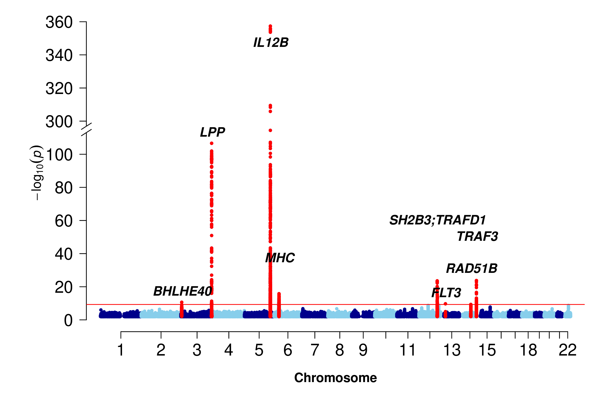

```{r setup, include=FALSE}
set.seed(0)
options(rmarkdown.html_vignette.check_title = FALSE)
knitr::opts_chunk$set(
  out.extra = 'style="display:block; margin: auto"',
  fig.align = "center",
  fig.path = "./",
  collapse = TRUE,
  comment = "#>",
  dev = "png")
```

# Introduction

This package was initiated to integrate some C/Fortran/SAS programs I have written 
or used over the years. As such, it would rather be a long-term project, but an
immediate benefit is something complementary to other packages currently available
from CRAN, e.g. **genetics**, **hwde**, etc. I hope eventually this will be part
of a bigger effort to fulfil most of the requirements foreseen by many @guo00,
within the portable environment of R for data management, analysis, graphics and
object-oriented programming. My view has been outlined more formally [@zhao06a; @zhao06b]
in relation to other package systems and also on package **kinship** [@zhao05; @zhao06c].
I feel the enormous advantage by shifting to R and would like to my work with others
as it is available, which I will not claim this work as exclusively done by myself,
but would like to invite others to join me and enlarge the collections and improve them.

With recent work on genomewide association studies (GWASs) especially protein GWASs, I
have added many functions such as `METAL_forestplot` which handles data from software
METAL @willer10 and `qtlFinder` which extracts sentinels from GWAS summary statistics
in a way that is very appealing to us compared to some other established software.
Meanwhile, the size of the package surpasses the limit as imposed by CRAN, thus the
old good feature of `S` as with `R` that value both code and data alike has to suffer
slightly in that **gap.datasets** and **gap.examples** are spun off as two separate
packages; they do deserve a glimpse however for some general ideas. A separate
initiative has been made in the **pQTLtools** package.

Notable recent technical updates include:

1. documentaion from R code via **roxygen2** and **devtools** to allow for easier
   generation of the .Rd files and NAMESPACE.

2. vignettes with noweb/Sweave as well as **rmarkdown** and **bookdown** that allows
   for numbered sectioning, multiple figures generated from a code chunk, and
   Citation Style Language (CSL) (https://citationstyles.org/). **Rdpack** is now
   employed for BibTeX citations in the .Rd files.

3. an experimental shiny App (`runshinygap`()).

These experiences can be useful for others in their package development. I found it
useful to use specific functions without loading the whole package, i.e., `library(gap)`,
e.g.,`invnormal <- gap::invnormal`, `log10p <- gap::log10p`.

# Implementation

The currently available functions are shown below,

Name              |      Description
------------------|------------------------------------------------------------------
**ANALYSIS** | &nbsp;
AE3               |      AE model using nuclear family trios
bt                |      Bradley-Terry model for contingency table
ccsize            |      Power and sample size for case-cohort design
cs                |      Credibel set
fbsize            |      Sample size for family-based linkage and association design
gc.em             |      Gene counting for haplotype analysis
gcontrol          |      genomic control
gcontrol2         |      genomic control based on p values
gcp               |      Permutation tests using GENECOUNTING
gc.lambda         |      Estionmation of the genomic control inflation statistic (lambda)
genecounting      |      Gene counting for haplotype analysis
gif               |      Kinship coefficient and genetic index of familiality
MCMCgrm           |      Mixed modeling with genetic relationship matrices
hap               |      Haplotype reconstruction
hap.em            |      Gene counting for haplotype analysis
hap.score         |      Score statistics for association of traits with haplotypes
htr               |      Haplotype trend regression
hwe               |      Hardy-Weinberg equilibrium test for a multiallelic marker
hwe.cc            |      A likelihood ratio test of population Hardy-Weinberg equilibrium
hwe.hardy         |      Hardy-Weinberg equilibrium test using MCMC
invnormal         |      Inverse normal transformation
kin.morgan        |      kinship matrix for simple pedigree
LD22              |      LD statistics for two diallelic markers
LDkl              |      LD statistics for two multiallelic markers
lambda1000        |      A standardized estimate of the genomic inflation scaling to
&nbsp;            |      a study of 1,000 cases and 1,000 controls
log10p            |      log10(p) for a standard normal deviate
log10pvalue       |      log10(p) for a P value including its scientific format
logp              |      log(p) for a normal deviate
masize            |      Sample size calculation for mediation analysis
mia               |      multiple imputation analysis for hap
mr                |      Mendelian randomization analysis
mtdt              |      Transmission/disequilibrium test of a multiallelic marker
mtdt2             |      Transmission/disequilibrium test of a multiallelic marker
&nbsp;            |      by Bradley-Terry model
mvmeta            |      Multivariate meta-analysis based on generalized least squares
pbsize            |      Power for population-based association design
pbsize2           |      Power for case-control association design
pfc               |      Probability of familial clustering of disease
pfc.sim           |      Probability of familial clustering of disease
pgc               |      Preparing weight for GENECOUNTING
print.hap.score   |      Print a hap.score object
s2k               |      Statistics for 2 by K table
sentinels         |      Sentinel identification from GWAS summary statistics
tscc              |      Power calculation for two-stage case-control design
&nbsp; | &nbsp;
**GRAPHICS** | &nbsp;
asplot            |      Regional association plot
ESplot            |      Effect-size plot
circos.cnvplot    |      circos plot of CNVs
circos.cis.vs.trans.plot | circos plot of cis/trans classification
circos.mhtplot    |      circos Manhattan plot with gene annotation
circos.mhtplot2   |      Another circos Manhattan plot
cnvplot           |      genomewide plot of CNVs
labelManhattan    |      Annotate Manhattan or Miami Plot
METAL_forestplot  |      forest plot as R/meta's forest for METAL outputs
makeRLEplot       |      make relative log expression plot
mhtplot           |      Manhattan plot
mhtplot2          |      Manhattan plot with annotations
mhtplot.trunc     |      truncated Manhattan plot
miamiplot         |      Miami plot
miamiplot2        |      Miami plot
mr_forestplot     |      Mendelian Randomization forest plot
pedtodot          |      Converting pedigree(s) to dot file(s)
pedtodot_verbatim |      Pedigree-drawing with graphviz
plot.hap.score    |      Plot haplotype frequencies versus haplotype score statistics
qqfun             |      Quantile-comparison plots
qqunif            |      Q-Q plot for uniformly distributed random variable
qtl2dplot         |      2D QTL plot
qtl2dplotly       |      2D QTL plotly
qtl3dplotly       |      3D QTL plotly
&nbsp; | &nbsp;
**UTILITIES** | &nbsp;
SNP               |      Functions for single nucleotide polymorphisms (SNPs)
BFDP              |      Bayesian false-discovery probability
FPRP              |      False-positive report probability
ab                |      Test/Power calculation for mediating effect
b2r               |      Obtain correlation coefficients and their variance-covariances
chow.test         |      Chow's test for heterogeneity in two regressions
chr\_pos\_a1\_a2  |      Form SNPID from chromosome, posistion and alleles
cis.vs.trans.classification | a cis/trans classifier
ci2ms             |      Effect size and standard error from confidence interval
comp.score        |      score statistics for testing genetic linkage of quantitative trait
GRM functions     |      ReadGRM, ReadGRMBin, ReadGRMPLINK,
&nbsp;            |      ReadGRMPCA, WriteGRM,
&nbsp;            |      WriteGRMBin, WriteGRMSAS
&nbsp;            |      handle genomic relationship matrix involving other software
get_b_se          |      Get b and se from AF, n, and z
get_pve_se        |      Get pve and its standard error from n, z
get_sdy           |      Get sd(y) from AF, n, b, se
h2G               |      A utility function for heritability
h2GE              |      A utility function for heritability involving gene-environment interaction
h2l               |      A utility function for converting observed heritability to its counterpart
&nbsp;            |      under liability threshold model
h2_mzdz           |      Heritability estimation according to twin correlations
klem              |      Haplotype frequency estimation based on a genotype table
&nbsp;            |      of two multiallelic markers
makeped           |      A function to prepare pedigrees in post-MAKEPED format
metap             |      Meta-analysis of p values
metareg           |      Fixed and random effects model for meta-analysis
muvar             |      Means and variances under 1- and 2- locus (diallelic) QTL model
pvalue            |      P value for a normal deviate
qtlClassifier     |      A QTL cis/trans classifier
qtlFinder         |      Distance-based signal identification
read.ms.output    |      A utility function to read ms output
revStrand         |      Allele on the reverse strand
runshinygap       |      Start shinygap
snptest\_sample   |      A utility to generate SNPTEST sample file
whscore           |      Whittemore-Halpern scores for allele-sharing
weighted.median   |      Weighted median with interpolation

After installation, you will be able to obtain the list by typing `library(help=gap)`
in alphabetical order, or `?gap::gap` ordered by category, or view it within a web
browser via `help.start()`. A full list of functions is provided in the Appendix.
This file can be viewed with command `vignette("gap", package="gap")`. You can cut
and paste examples at end of each function's documentation.

Both `genecounting` and `hap` are able to handle SNPs and multiallelic
markers, with the former be flexible enough to include features such as X-linked data
and the later being able to handle large number of SNPs. But they are unable to
recode allele labels automatically, so functions `gc.em` and `hap.em` are in
`haplo.em` format and used by a modified function `hap.score` in association testing.

It is notable that multilocus data are handled differently from that in **hwde** and
elegant definitions of basic genetic data can be found in the **genetics** package.
Incidentally, I found my C mixed-radixed sorting routine @zhao03 is much faster than
R's internal function.

With exceptions such as function `pfc` which is very computer-intensive, most functions
in the package can easily be adapted for analysis of large datasets involving either
SNPs or multiallelic markers. Some are utility functions, e.g. `muvar` and `whscore`,
which will be part of the other analysis routines in the future.

The benefit with R compared to standalone programs is that for users, all functions have
unified format. For developers, it is able to incorporate their C/C++ programs more
easily and avoid repetitive work such as preparing own routines for matrix algebra and
linear models. Further advantage can be taken from packages in **Bioconductor**, which
are designed and written to deal with large number of genes.

# Independent programs

To facilitate comparisons and individual preferences, the source codes for EHPLUS @zhao00,
2LD, GENECOUNTING, HAP @zhao04, now hosted at GitHub, have enjoyed great popularity ahead
of GWASs therefore are likely to be more familiar than their R counterparts in `gap` but
you need to follow their instructions to compile for a particular computer system.

I have kept the original `pedtodot.sh` by David Duffy which enables contrast with
`pedtodot_verbatim()` and `pedtodot()` reported as application notes. I have also included
`ms` code @hudson02 to couple with `read.ms.output`.

A final note is concerned about `twinan90`, which is now dropped from the package function
list due to difficulty to keep up with the requirements by the `R` environment nevertheless
you will still be able to compile and use otherwise from **gap.examples**.

# Demos

This has been a template for adding self-contained examples:

```r
library(gap)
demo(gap)
```

See examples of haplotype analysis there.

# Pedigrees and kinship

## Pedigree drawing

I have included the original file for the *R News* as well as put examples in separate 
vignettes. They can be accessed via `vignette("rnews",package="gap.examples")` and 
`vignette("pedtodot", package="gap.examples")`, respectively.

We also demonstrate through pedigree 10081 example @zhao06c with `pedtodot_verbatim`.

```{r, echo=FALSE}
p1 <- "
 1  2   3  2  2  7/7  7/10
 2  0   0  1  1  -/-  -/-
 3  0   0  2  2  7/9  3/10
 4  2   3  2  2  7/9  3/7
 5  2   3  2  1  7/7  7/10
 6  2   3  1  1  7/7  7/10
 7  2   3  2  1  7/7  7/10
 8  0   0  1  1  -/-  -/-
 9  8   4  1  1  7/9  3/10
10  0   0  2  1  -/-  -/-
11  2  10  2  1  7/7  7/7
12  2  10  2  2  6/7  7/7
13  0   0  1  1  -/-  -/-
14 13  11  1  1  7/8  7/8
15  0   0  1  1  -/-  -/-
16 15  12  2  1  6/6  7/7
"

p2 <- as.data.frame(scan(file=textConnection(p1),what=list(0,0,0,0,0,"","")))
names(p2) <-c("id","fid","mid","sex","aff","GABRB1","D4S1645")
p3 <- data.frame(pid=10081,p2)
```

```{r pedtodot, fig.cap="An example pedigree", fig.height=8, fig.width=7}
library(gap)
knitr::kable(p3,caption="An example pedigree")
library(DOT)
# one can see the diagram in RStudio
pedtodot_verbatim(p3,run=TRUE,toDOT=TRUE,return="verbatim")
library(DiagrammeR)
pedtodot_verbatim(p3)
grViz(readr::read_file("10081.dot"))
```

## Kinship calculation

Next, I will provide an example for kinship calculation using `kin.morgan`.
It is recommended that individuals in a pedigree are ordered so that parents
always precede their children. In this regard, package **pedigree** can be
used, and package **kinship2** can be used to produce pedigree diagram as with
kinship matrix.

The pedigree diagram is as follows,

```{r lukas, fig.cap="A pedigree diagram", fig.height=8, fig.width=7}
# pedigree diagram
data(lukas, package="gap.datasets")
library(kinship2)
ped <- with(lukas,pedigree(id,father,mother,sex))
plot(ped,cex=0.4)
```

We then turn to the kinship calculation.

```{r}
# unordered individuals
gk1 <- kin.morgan(lukas)
write.table(gk1$kin.matrix,"gap_1.txt",quote=FALSE)

library(kinship2)
kk1 <- kinship(lukas[,1],lukas[,2],lukas[,3])
write.table(kk1,"kinship_1.txt",quote=FALSE)

d <- gk1$kin.matrix-kk1
sum(abs(d))

# order individuals so that parents precede their children
library(pedigree)
op <- orderPed(lukas)
olukas <- lukas[order(op),]
gk2 <- kin.morgan(olukas)

write.table(olukas,"olukas.csv",quote=FALSE)
write.table(gk2$kin.matrix,"gap_2.txt",quote=FALSE)

kk2 <- kinship(olukas[,1],olukas[,2],olukas[,3])
write.table(kk2,"kinship_2.txt",quote=FALSE)

z <- gk2$kin.matrix-kk2
sum(abs(z))
```

We see that in the second case, the result agrees with **kinship2**.

# Study designs

I would like to highlight `fbsize`, `pbsize` and `ccsize` functions used
for power/sample calculations in a genome-wide asssociatoin study as
reported @risch96, @risch97, @zhao07.

It now has an experimental work via Shiny from `inst/shinygap`.

## Family-based design

The example is as follows,

```{r fb}
options(width=150)
library(gap)
models <- matrix(c(
         4.0, 0.01,
         4.0, 0.10,
         4.0, 0.50, 
         4.0, 0.80,
         2.0, 0.01,
         2.0, 0.10,
         2.0, 0.50,
         2.0, 0.80,
         1.5, 0.01,    
         1.5, 0.10,
         1.5, 0.50,
         1.5, 0.80), ncol=2, byrow=TRUE)
outfile <- "fbsize.txt"
cat("gamma","p","Y","N_asp","P_A","H1","N_tdt","H2","N_asp/tdt",
    "L_o","L_s\n",file=outfile,sep="\t")
for(i in 1:12) {
    g <- models[i,1]
    p <- models[i,2]
    z <- fbsize(g,p)
    cat(z$gamma,z$p,z$y,z$n1,z$pA,z$h1,z$n2,z$h2,z$n3,
        z$lambdao,z$lambdas,file=outfile,append=TRUE,sep="\t")
    cat("\n",file=outfile,append=TRUE)
}
table1 <- read.table(outfile,header=TRUE,sep="\t")
nc <- c(4,7,9)
table1[,nc] <- ceiling(table1[,nc])
dc <- c(3,5,6,8,10,11)
table1[,dc] <- round(table1[,dc],2)
unlink(outfile)
knitr::kable(table1,caption="Power/Sample size of family-based designs")
```

As for APOE4 and Alzheimer's @sph97

```{r alz}
g <- 4.5
p <- 0.15
alz <- data.frame(fbsize(g,p))
knitr::kable(alz,caption="Power/Sample size of study on Alzheimer's disease")
```

## Population-based design

The example is as follows,

```{r pb}
library(gap)
kp <- c(0.01,0.05,0.10,0.2)
models <- matrix(c(
          4.0, 0.01,
          4.0, 0.10,
          4.0, 0.50, 
          4.0, 0.80,
          2.0, 0.01,
          2.0, 0.10,
          2.0, 0.50,
          2.0, 0.80,
          1.5, 0.01,    
          1.5, 0.10,
          1.5, 0.50,
          1.5, 0.80), ncol=2, byrow=TRUE)
outfile <- "pbsize.txt"
cat("gamma","p","p1","p5","p10","p20\n",sep="\t",file=outfile)
for(i in 1:dim(models)[1])
{
   g <- models[i,1]
   p <- models[i,2]
   n <- vector()
   for(k in kp) n <- c(n,ceiling(pbsize(k,g,p)))
   cat(models[i,1:2],n,sep="\t",file=outfile,append=TRUE)
   cat("\n",file=outfile,append=TRUE)
} 
table5 <- read.table(outfile,header=TRUE,sep="\t")
knitr::kable(table5,caption="Sample size of population-based design")
```

## Case-cohort design

We obtain results for ARIC and EPIC studies.

```{r}
library(gap)
# ARIC study
outfile <- "aric.txt"
n <- 15792
pD <- 0.03
p1 <- 0.25
alpha <- 0.05
theta <- c(1.35,1.40,1.45)
beta <- 0.2
s_nb <- c(1463,722,468)
cat("n","pD","p1","hr","q","power","ssize\n",file=outfile,sep="\t")
for(i in 1:3)
{
  q <- s_nb[i]/n
  power <- ccsize(n,q,pD,p1,log(theta[i]),alpha,beta,TRUE)
  ssize <- ccsize(n,q,pD,p1,log(theta[i]),alpha,beta,FALSE)
  cat(n,"\t",pD,"\t",p1,"\t",theta[i],"\t",q,"\t",
      signif(power,3),"\t",ssize,"\n",
      file=outfile,append=TRUE)
}
read.table(outfile,header=TRUE,sep="\t")
unlink(outfile)
# EPIC study
outfile <- "epic.txt"
n <- 25000
alpha <- 0.00000005
beta <- 0.2
s_pD <- c(0.3,0.2,0.1,0.05)
s_p1 <- seq(0.1,0.5,by=0.1)
s_hr <- seq(1.1,1.4,by=0.1)
cat("n","pD","p1","hr","alpha","ssize\n",file=outfile,sep="\t")
# direct calculation
for(pD in s_pD)
{
   for(p1 in s_p1)
   {
      for(hr in s_hr)
      {
         ssize <- ccsize(n,q,pD,p1,log(hr),alpha,beta,FALSE)
         if (ssize>0) cat(n,"\t",pD,"\t",p1,"\t",hr,"\t",alpha,"\t",
                          ssize,"\n",
                          file=outfile,append=TRUE)
      }
   }
}
knitr::kable(read.table(outfile,header=TRUE,sep="\t"),caption="Sample size of case-cohort designs")
unlink(outfile)
```

# Graphics

Some figures from the documentation may be of interest.

## Genome-wide association

The following code is used to obtain a Q-Q plot via `qqunif` function,

```{r qq, fig.cap="A Q-Q plot", fig.height=7, fig.width=7}
library(gap)
u_obs <- runif(1000)
r <- qqunif(u_obs,pch=21,bg="blue",bty="n")
u_exp <- r$y
hits <- u_exp >= 2.30103
points(r$x[hits],u_exp[hits],pch=21,bg="green")
legend("topleft",sprintf("GC.lambda=%.4f",gc.lambda(u_obs)))
```

Based on a chicken genome scan data, the code below generates a Manhattan plot, demonstrating
the use of gaps to separate chromosomes.

```{r chicken, fig.cap="A genome-wide association study on chickens", fig.height=7, fig.width=7, results="hide"}
ord <- with(w4,order(chr,pos))
w4 <- w4[ord,]
oldpar <- par()
par(cex=0.6)
colors <- c(rep(c("blue","red"),15),"red")
mhtplot(w4,control=mht.control(colors=colors,gap=1000),pch=19,srt=0)
axis(2,cex.axis=2)
suggestiveline <- -log10(3.60036E-05)
genomewideline <- -log10(1.8E-06)
abline(h=suggestiveline, col="blue")
abline(h=genomewideline, col="green")
abline(h=0)
```

The code below obtains a Manhattan plot with gene annotation @kilpelainen11,

```{r mhtplot, fig.cap="A Manhattan plot with gene annotation", fig.height=7, fig.width=7, messages=FALSE, results="hide"}
data <- with(mhtdata,cbind(chr,pos,p))
glist <- c("IRS1","SPRY2","FTO","GRIK3","SNED1","HTR1A","MARCH3","WISP3",
           "PPP1R3B","RP1L1","FDFT1","SLC39A14","GFRA1","MC4R")
hdata <- subset(mhtdata,gene%in%glist)[c("chr","pos","p","gene")]
color <- rep(c("lightgray","gray"),11)
glen <- length(glist)
hcolor <- rep("red",glen)  
par(las=2, xpd=TRUE, cex.axis=1.8, cex=0.4)
ops <- mht.control(colors=color,yline=1.5,xline=3)
hops <- hmht.control(data=hdata,colors=hcolor)
mhtplot(data,ops,hops,pch=19)
axis(2,pos=2,at=1:16,cex.axis=0.5)
```

All these look familiar, so revised form of the function called `mhtplot2` was
created for additional features such as centering the chromosome ticks, allowing for 
more sophisticated coloring schemes, using prespecified fonts, etc. Please refer to
the function's documentation example.

We could also go further with a circos Manhattan plot,

```{r circos, fig.cap="A circos Manhattan plot", fig.height=7, fig.width=8}
circos.mhtplot(mhtdata, glist)
```

and a version with y-axis,

```{r circos2, fig.cap="Another circos Manhattan plot", fig.height=7, fig.width=8}
require(gap.datasets)
library(dplyr)
testdat <- mhtdata[c("chr","pos","p","gene","start","end")] %>%
           rename(log10p=p) %>%
           mutate(chr=paste0("chr",chr),log10p=-log10(log10p))
dat <- mutate(testdat,start=pos,end=pos) %>%
       select(chr,start,end,log10p)
labs <- subset(testdat,gene %in% glist) %>%
        group_by(gene,chr,start,end) %>%
        summarize() %>%
        mutate(cols="blue") %>%
        select(chr,start,end,gene,cols)
labs[2,"cols"] <- "red"
ticks <- 0:2*5
circos.mhtplot2(dat,labs,ticks=ticks,ymax=max(ticks))
```

As a side note, the data is used by `manhattanly`.

```r
#{r mhttest, fig.cap="Manhattanly plot", fig.height=8, fig.width=8, plotly=TRUE}
library(manhattanly)
mhttest <- manhattanly(mhtdata, chr = "chr", bp = "pos",
                       snp = "rsn", annotation1 = "gene", suggestiveline = TRUE,
                       annotation2 = "rsn", p = "p")
mhttest
htmlwidgets::saveWidget(mhttest,"mhttest.html")
```

We now experiment with Miami plot,

```{r miami, fig.cap="Miami plots", fig.height=7, fig.width=7}
mhtdata <- within(mhtdata,{pr=p})
miamiplot(mhtdata,chr="chr",bp="pos",p="p",pr="pr",snp="rsn")
# An alternative implementation
gwas <- select(mhtdata,chr,pos,p) %>%
        mutate(z=qnorm(p/2))
chrmaxpos <- miamiplot2(gwas,gwas,name1="Batch 2",name2="Batch 1",z1="z",z2="z")
labelManhattan(chr=c(2,16),pos=c(226814165,52373776),name=c("AnonymousGene","FTO"),gwas,gwasZLab="z",chrmaxpos=chrmaxpos)
```

and a truncated Manhattan plot, noting that only data points with -log10(P)>=2 are shown,

```r
par(oma=c(0,0,0,0), mar=c(5,6.5,1,1))
mhtplot.trunc(filter(IL.12B,log10P>=2), chr="Chromosome", bp="Position", z="Z",
   snp="MarkerName",
   suggestiveline=FALSE, genomewideline=-log10(5e-10),
   cex.mtext=1.2, cex.text=1.2,
   annotatelog10P=-log10(5e-10), annotateTop = FALSE,
   highlight=with(genes,gene),
   mtext.line=3, y.brk1=115, y.brk2=300, trunc.yaxis=TRUE, delta=0.01,
   cex.axis=1.5, cex=0.8, font=3, font.axis=1.5,
   y.ax.space=20,
   col = c("blue4", "skyblue")
)
```

```{r il12b, echo=FALSE, fig.align="left", fig.cap="Association of IL-12B", fig.height=6, fig.width=6}

```

The code below obtains a regional association plot with the `asplot` function,

```{r asplot, fig.cap="A regional association plot", fig.height=7, fig.width=7}
asplot(CDKNlocus, CDKNmap, CDKNgenes, best.pval=5.4e-8, sf=c(3,6))
title("CDKN2A/CDKN2B Region")
```

The function predates the currently popular **locuszoom** software but leaves
the option open for generating such plots on the fly and locally.

Note that all these can serve as templates to customize features of your own.

## Copy number variation

A plot of copy number variation (CNV) is shown here,

```{r cnv, fig.cap="A CNV plot", fig.height=7, fig.width=7}
cnvplot(gap.datasets::cnv)
```

## Effect size plot

The code below obtains an effect size plot via the `ESplot` function.

```{r esplot, fig.cap="rs12075 and traits", fig.height=7, fig.width=7}
library(gap)
rs12075 <- data.frame(id=c("CCL2","CCL7","CCL8","CCL11","CCL13","CXCL6","Monocytes"),
                      b=c(0.1694,-0.0899,-0.0973,0.0749,0.189,0.0816,0.0338387),
                      se=c(0.0113,0.013,0.0116,0.0114,0.0114,0.0115,0.00713386))
ESplot(rs12075)
```

## Forest plot

It draws many forest plots given a list of variants, e.g.,

```{r forest, fig.cap="Forest plots", fig.height=6, fig.width=9, results="hide", warning=FALSE}
data(OPG,package="gap.datasets")
meta::settings.meta(method.tau="DL")
METAL_forestplot(OPGtbl,OPGall,OPGrsid,width=6.75,height=5,digits.TE=2,digits.se=2,
                 col.diamond="black",col.inside="black",col.square="black")
METAL_forestplot(OPGtbl,OPGall,OPGrsid,package="metafor",method="FE",xlab="Effect",
                 showweights=TRUE)
```

# Significance

Our focus is on z ~ Normal(0,1), whose schematic diagram is shown below.

```{r normal, echo=FALSE, fig.cap="Normal(0,1) distribution", fig.height=5, fig.width=9}
library(lattice)
z0 <- 1.96
z <- 5
a <- seq(-z, z, length = 10000)
b <- dnorm(a, 0, 1)
xyplot(b ~ a,
       type = "l",
       panel = function(x,y, ...)
               {
                   panel.xyplot(x,y, ...)
                   panel.abline(v = 0, lty = 2)
                   xx <- c(-z, x[x>=-z & x<=-z0], -z0)
                   yy <- c(0, y[x>=-z & x<=-z0], 0)
                   panel.polygon(xx,yy, ..., col='red')
                   xx <- c(z0, x[x>=z0 & x<=z], z)
                   yy <- c(0, y[x>=z0 & x<=z], 0)
                   panel.polygon(xx,yy, ..., col='red')
               },
       xlab="z",
       ylab=expression(1/sqrt(2*pi) * exp(-z^2/2))
)
```

The associate R function is `z <- function(p) qnorm(p/2,lower.tail=FALSE)`.

When z is very large, its corresponding p value is very small. A genomewide significance is declared at 0.05/1000000=5e-8 with Bonferroni correction assuming 1 million SNPs are tested. This short note describes how to get -log10(p), which can be used in a Q-Q plot and software such as DEPICT @pers15. The solution here is generic since z is also the square root of a chi-squared statistic, for instance.

## log(p) and log10(p)

First thing first, here are the answers for log(p) and log10(p) given z,
```r
# log(p) for a standard normal deviate z based on log()
logp <- function(z) log(2)+pnorm(-abs(z), lower.tail=TRUE, log.p=TRUE)

# log10(p) for a standard normal deviate z based on log()
log10p <- function(z) log(2, base=10)+pnorm(-abs(z), lower.tail=TRUE, log.p=TRUE)/log(10)
```
Note `logp()` will be used for functions such as `qnorm()` as in function `cs()` whereas `log10p()` is more appropriate for Manhattan plot and used in `sentinels()`.

## Rationale

We start with z=1.96 whose corresponding p value is approximately 0.05.
```r
2*pnorm(-1.96,lower.tail=TRUE)
```
giving an acceptable value 0.04999579, so we proceed to get log10(p)
```r
log10(2)+log10(pnorm(-abs(z),lower.tail=TRUE))
```
leading to the expression above from the fact that log10(X)=log(X)/log(10) since log(),
being the natural log function, ln() -- so log(exp(1)) = 1, in R, works far better on
the numerator of the second term. The use of -abs() just makes sure we are working on
the lower tail of the standard Normal distribution from which our p value is calculated.

## Benchmark

Now we have a stress test,
```r
z <- 20000
-log10p(z)
```
giving -log10(p) = 86858901.

## Multiple precision arithmetic

We would be curious about the p value itself as well, which is furnished with the Rmpfr package
```r
require(Rmpfr)
2*pnorm(mpfr(-abs(z),100),lower.tail=TRUE,log.p=FALSE)
mpfr(log(2),100) + pnorm(mpfr(-abs(z),100),lower.tail=TRUE,log.p=TRUE)
```
giving p = 1.660579603192917090365313727164e-86858901 and -log(p) = -200000010.1292789076808554854177,
respectively. To carry on we have -log10(p) = -log(p)/log(10)=86858901.

To make -log10(p) usable in R we obtain it directly through
```r
as.numeric(-log10(2*pnorm(mpfr(-abs(z),100),lower.tail=TRUE)))
```
which actually yields exactly the same 86858901.

If we go very far to have z=50,000. then -log10(p)=542868107 but we have less luck with Rmpfr.

One may wonder the P value in this case, which is 6.6666145952e-542868108 or simply 6.67e-542868108.

The magic function for doing this is defined as follows,
```r
pvalue <- function (z, decimals = 2)
{
    lp <- -log10p(z)
    exponent <- ceiling(lp)
    base <- 10^-(lp - exponent)
    paste0(round(base, decimals), "e", -exponent)
}
```
and it is more appropriate to express p values in scientific format so they can be
handled as follows,
```r
log10pvalue <- function(p=NULL,base=NULL,exponent=NULL)
{
  if(!is.null(p))
  {
    p <- format(p,scientific=TRUE)
    p2 <- strsplit(p,"e")
    base <- as.numeric(lapply(p2,"[",1))
    exponent <- as.numeric(lapply(p2,"[",2))
  } else if(is.null(base) | is.null(exponent)) stop("base and exponent should both be specified")
  log10(base)+exponent
}
```
used as `log10pvalue(p)` when p<=1e-323, or log10pvalue(base=1,exponent=-323) otherwise.

One can also derive logpvalue for natural base (e) similarly.

We end with a quick look-up table
```{r}
require(gap)
zlist <- c(5,10,30,40,50,100,500,1000,2000,3000,5000)
zp <- sapply(zlist,function(z) {c(z,pvalue(z),logp(z),log10p(z))})
rownames(zp) <- c("z","P","log(P)","log10(P)")
knitr::kable(t(zp),caption="z, P, log(P) and log10(P)")
```

## Application

The `mhtplot.trunc()` function accepts three types of arguments:

: p. P values of association statistics, which could be very small.
: log10p. log10(P).
: z. normal statistics that could be very large.

In all three cases, a log10(P) counterpart is obtained internally and to accommodate extreme value,
the y-axis allows for truncation leaving out a given range to highlight the largest.

See the IL-12B example above.

# Linear regression

Several functions related to linear regression are detailed here.

## Some preparations

Let $\mbox{x} = SNP\ dosage$. Note that $\mbox{Var}(\mbox{x})=2f(1-f)$, $f=MAF$ or $1-MAF$ by symmetry.

Our linear regression model is $\mbox{y}=a + b\mbox{x} + e$. We have $\mbox{Var}(\mbox{y}) = b^2\mbox{Var}(\mbox{x}) + \mbox{Var}(e)$. Moreover, $\mbox{Var}(b)=\mbox{Var}(e)(\mbox{x}'\mbox{x})^{-1}=\mbox{Var}(e)/S_\mbox{xx}$, we have $\mbox{Var}(e) = \mbox{Var}(b)S_\mbox{xx} = N \mbox{Var}(b) \mbox{Var}(\mbox{x})$. Consequently, let $z = {b}/{SE(b)}$, we have

\begin{eqnarray*}
\mbox{Var}(\mbox{y}) &=& \mbox{Var}(\mbox{x})(b^2+N\mbox{Var}(b)) \hspace{100cm} \cr
                     &=& \mbox{Var}(\mbox{x})\mbox{Var}(\mbox{b})(z^2+N) \cr
                     &=& 2f(1-f)(z^2+N)\mbox{Var}(b)
\end{eqnarray*} 

Moreover, the mean and the variance of the multiple correlation coefficient or the coefficient of determination ($R^2$) are known @kotz06 to be ${1}/{(N-1)}$ and ${2(N-2)}/{\left[(N-1)^2(N+1)\right]}$, respectively.

We also need some established results of a ratio (R/S)[^1], i.e., the mean

$$
\begin{align}
E(R/S) \approx \frac{\mu_R}{\mu_S}-\frac{\mbox{Cov}(R,S)}{\mu_S^2}+\frac{\sigma_S^2\mu_R}{\mu_S^3} \hspace{100cm} 
(\#eq:meanRatio)
\end{align}
$$

and more importantly the variance

$$
\begin{align}
\mbox{Var}(R/S) \approx \frac{\mu_R^2}{\mu_S^2} \left[
                        \frac{\sigma_R^2}{\mu_R^2} -2\frac{\mbox{Cov}(R,S)}{\mu_R\;\mu_S}
                       +\frac{\sigma_S^2}{\mu_S^2} \right] \hspace{100cm}
(\#eq:varRatio)
\end{align}
$$

where $\mu_R$, $\mu_S$, $\sigma_R^2$, $\sigma_S^2$ are the means and the variances for R and S, respectively.

Finally, we need some facts about $\chi_1^2$, $\chi^2$ distribution of one degree of freedom. For $z \sim N(0,1)$, $z^2\sim \chi_1^2$, whose mean and variance are 1 and 2, respectively.

We now have the following results.

## Proportion of variance explained

We have

$$
\begin{align}
\mbox{PVE}_{\mbox{linear regression}} & = \frac{\mbox{Var}(b\mbox{x})}{\mbox{Var}(\mbox{y})} \hspace{100cm} \\
           & = \frac{\mbox{Var}(\mbox{x})b^2}{\mbox{Var}(\mbox{x})(b^2+N\mbox{Var}(b))} \\
           & = \frac{\mbox{z}^2}{\mbox{z}^2+N}
(\#eq:pveLR)
\end{align}
$$

On the other hand, for a simple linear regression $R^2\equiv r^2$ where $r$ is the Pearson correlation coefficient, which is readily from the $t$-statistic of the regression slope, i.e., $r={t}/{\sqrt{t^2+N-2}}$. so assuming $t \equiv \ z \sim \chi_1^2$

$$
\begin{align}
\mbox{PVE}_{t-\mbox{statistic}} & = \frac{\chi^2}{\chi^2+N-2} \hspace{100cm}
(\#eq:pvet)
\end{align}
$$

To obtain coherent estimates of the asymptotic means and variances of both forms we resort to variance of a ratio (R/S). All the required elements are listed in a table below.

Characteristics   | Linear regression | $t$-statistic
------------------|-------------------|--------------
$\mu_R$           |  1    | 1
$\sigma_R^2$      |  2    | 2
$\mu_S$           | $N+1$ | $N-1$
$\sigma_S^2$      |  2    | 2
$\mbox{Cov}(R,S)$ |  2    | 2

then we have the means and the variances for PVE.

Characteristics          | Linear regression | $t$-statistic
-------------------------|:-----------------:|:--------------------------------------------------------------:
mean  | $\frac{1}{N+1}\left[1-\frac{2}{N+1}+\frac{2}{(N+1)^2}\right]$ | $\frac{1}{N-1}\left[1-\frac{2}{N-1}+\frac{2}{(N-1)^2}\right]$
variance | $\frac{2}{(N+1)^2}\left[1-\frac{1}{N+1}\right]^2$ | $\frac{2}{(N-1)^2}\left[1-\frac{1}{N-1}\right]^2$

Finally, our approximation of PVE for a protein with $T$ independent pQTLs from the meta-analysis

Characteristics          | Linear regression | $t$-statistic
-------------------------|:-----------------:|:----------------------------------------------------------:
estimate | $\sum_{i=1}^T{\frac{\chi_i^2}{\chi_i^2+N_i}}$ | $\sum_{i=1}^T{\frac{\chi_i^2}{\chi_i^2+N_i-2}}$
variance |$\sum_{i=1}^T\frac{2}{(N_i+1)^2}$ | $\sum_{i=1}^T\frac{2}{(N_i-1)^2}$

Therefore they differ from the asymptotic results @kotz06 by ratios of $(N-2)(N+1)/(N-1)^2$ and $(N-2)/(N+1)$ for
linear regression and $t$-statistic, respectively.

```{r pve, echo=FALSE, fig.cap="Comparisons of Var($R^2$) estimates", fig.height=6, fig.width=14, messages=FALSE, warning=FALSE}
oldpar <- par()
par(mfrow=c(1,2))
N <- 2:500
R2 <- 2*(N-2)/(N-1)^2/(N+1)
R2LR <- 2/(N+1)^2
R2t <- 2/(N-1)^2
plot(N,R2,cex=0.6,xaxt="n",xlab="Sample size",ylab=expression(Var(R^2)),col="black",pch=20)
points(N,R2LR,cex=0.6,pch=15,col="red")
points(N,R2t,cex=0.6,pch=17,col="blue")
axis(1,at=c(2,(1:5)*100))
legend(400,0.03,c("Asymptotic","LR","t-statistic"),col=c("black","red","blue"),pch=c(20,15,17))
sLR <- (N-2)*(N+1)/(N-1)^2
st <- (N-2)/(N+1)
plot(N,sLR,cex=0.6,xaxt="n",xlab="Sample size",ylab="Asymptotic/approximation estimator ratio",col="red",pch=20)
points(N,st,cex=0.6,pch=15,col="blue")
abline(h=1,col="black")
axis(1,at=c(2,(1:5)*100))
legend(400,0.2,c("Asymptotic","LR","t-statistic"),col=c("black","red","blue"),pch=c(20,15,17))
par(oldpar)
```

As the sample size increases, the estimates are quite close nevertheless quite small while the ratios approach 1 quickly from opposite sides after $N\approx 300$.

## Effect size and standard error

When $\mbox{Var}(\mbox{y})=1$, as in cis eQTLGen @vosa21 data, we have $b$ and its standard error (se) as follows,

$$
\begin{align}
b & = z/d \hspace{100cm} \\ 
se & = 1/d
(\#eq:bSE)
\end{align}
$$

where $d = \sqrt{2f(1-f)(z^2+N)}$.

Now three functions are in place.

## get_b_se

A record of the eQTLGen data is shown below

```
        SNP    Pvalue SNPChr  SNPPos AssessedAllele OtherAllele Zscore
 rs1003563 2.308e-06     12 6424577              A           G 4.7245
            Gene GeneSymbol GeneChr GenePos NrCohorts NrSamples         FDR
 ENSG00000111321       LTBR      12 6492472        34     23991 0.006278872
 BonferroniP hg19_chr hg19_pos AlleleA AlleleB allA_total allAB_total
           1       12  6424577       A       G       2574        8483
 allB_total AlleleB_all
       7859   0.6396966
```

from which we obtain the effect size and its standard error as follows,

```{r}
get_b_se(0.6396966,23991,4.7245)
```

## get_pve_se

This function obtains proportion of explained variation (PVE) from n, z; its
standard error is based on variance of the ratio (correction=TRUE) or $r^2$.

## get_sdy

We continue with the eQTLGen example above,

```{r}
get_sdy(0.6396966,23991,0.04490488,0.009504684)
```

and indeed the eQTLGen data were standardized.

# Sentinels of association

## Identification

Following an earlier implementation called `sentinels`, a distance-based signal
identification based on GWAS summary statistics is avaialable from `qtlFinder`
function; to avoid the overhead of data-loading it works on a preselected list
of variants from a GWAS and in this case a METAL output file.

## Fine-mapping

We considered a region of interest (which could be approximately independent variants,
e.g., $r^2 \le 0.5$) using expressions that rely on effect sizes and their standard
errors @graham21. More specifically, let Bayes factor (BF) for each variant in the
meta-analysis be defined as $ln(BF) \propto 0.5 \beta^2/SE^2$, where $\beta$ and $SE$
are the effect size and standard error from the meta-analysis, respectively. The
posterior probability (PP) for being causal for a particular variant is obtained as
$BF_i/\sum_{i=1}^TBF_i$, where $i=1,\ldots,T$ indexes all variants considered in the
region. We generated credible sets within a given region by ranking all variants by
PPs in descending order and calculating the number of variants required to reach a
cumulative probability of such as 99\%.

The function `cs` obtains credible set.
```r
# zcat METAL/4E.BP1-1.tbl.gz | \
# awk 'NR==1 || ($1==4 && $2 >= 187158034 - 1e6 && $2 < 187158034 + 1e6)' >  4E.BP1.z
tbl <- within(read.delim("4E.BP1.z"),{logp <- logp(Effect/StdErr)})
z <- cs(tbl)
l <- cs(tbl,log_p="logp")
```

Note in particular that the implementation intends to avoid the naive summation in
scenarios such as proteogenomic analysis containing exceptionally large BFs.

# Polygenic modeling

In line with the recent surge of interest in the polygenic models, a separate vignette
is available through `vignette("h2",package="gap.examples")` demonstrating aspect of
the models on heritability. Utility Functions `h2G`, `h2GE` and `h2l` are briefly
documented. Functions `h2.jags` and `hwe.jags` are also available. The function
`h2_mzdz` can be used for heritability estimation based on monozygotic (MZ) and
dizygotic (DZ) twin correlations under the additive genetics, common and specific
environment (ACE) model, e.g., [10.1038/s41562-023-01530-y](https://doi.org/10.1038/s41562-023-01530-y).

# Mendelian randomization

## The `mr` function

The function `mr` was originally developed to rework on data generated from GSMR @zhu18, although it could be any harmonised data. The following example is from analysis of a real data on LIF-R protein and CVD/FEV1.

```{r mrdat, echo=FALSE}
mrdat <- '
 rs188743906  0.6804   0.1104  0.00177 0.01660        NA        NA
   rs2289779 -0.0788   0.0134  0.00104 0.00261 -0.007543 0.0092258
 rs117804300 -0.2281   0.0390 -0.00392 0.00855  0.109372 0.0362219
   rs7033492 -0.0968   0.0147 -0.00585 0.00269  0.022793 0.0119903
  rs10793962  0.2098   0.0212  0.00378 0.00536 -0.014567 0.0138196
    rs635634 -0.2885   0.0153 -0.02040 0.00334  0.077157 0.0117123
    rs176690 -0.0973   0.0142  0.00293 0.00306 -0.000007 0.0107781
 rs147278971 -0.2336   0.0378 -0.01240 0.00792  0.079873 0.0397491
  rs11562629  0.1155   0.0181  0.00960 0.00378 -0.010040 0.0151460
'
mrdat <- setNames(as.data.frame(scan(file=textConnection(mrdat), what=list("",0,0,0,0,0,0))), 
         c("SNP", "b.LIF.R", "SE.LIF.R", "b.FEV1", "SE.FEV1", "b.CAD", "SE.CAD"))
knitr::kable(mrdat,caption="LIF-R and CAD/FEV1")
```

The MR analysis is as follows,

```{r mr, echo=FALSE, fig.cap="Mendelian randomization", fig.height=7, fig.width=7}
res <- mr(mrdat, "LIF.R", c("CAD","FEV1"), other_plots=TRUE)
s <- res$r[-1,]
colnames(s) <- res$r[1,]
r <- matrix(as.numeric(s[,-1]),nrow(s),dimnames=list(res$r[-1,1],res$r[1,-1]))
p <- sapply(c("IVW","EGGER","WM","PWM"), function(x)
     format(2*pnorm(-abs(r[,paste0("b",x)]/r[,paste0("seb",x)])),digits=3,scientific=TRUE))
rp <- t(data.frame(round(r,3),p))
knitr::kable(rp, align="r", caption="LIFR variant rs635634 and CAD/FEV1")
```

This is close to Ligthart et al. @ligthart18 as used one time at workplace which turns to overlap with TwoSampleMR @hemani18.

## Contrast of effect sizes

It would be of interest to contrast their effect sizes in the analysis above as well,

```{r mr2, fig.cap="Combined forest plots for LIF.R, FEV1 and CAD", fig.height=7, fig.width=7}
mr_names <- names(mrdat)
LIF.R <- cbind(mrdat[grepl("SNP|LIF.R",mr_names)],trait="LIF.R"); names(LIF.R) <- c("SNP","b","se","trait")
FEV1 <- cbind(mrdat[grepl("SNP|FEV1",mr_names)],trait="FEV1"); names(FEV1) <- c("SNP","b","se","trait")
CAD <- cbind(mrdat[grepl("SNP|CAD",mr_names)],trait="CAD"); names(CAD) <- c("SNP","b","se","trait")
mrdat2 <- within(rbind(LIF.R,FEV1,CAD),{y=b})
library(ggplot2)
p <- ggplot2::ggplot(mrdat2,aes(y = SNP, x = y))+
     ggplot2::theme_bw()+
     ggplot2::geom_point()+
     ggplot2::facet_wrap(~ trait, ncol=3, scales="free_x")+
     ggplot2::geom_segment(aes(x = b-1.96*se, xend = b+1.96*se, yend = SNP))+
     ggplot2::geom_vline(lty=2, ggplot2::aes(xintercept=0), colour = 'red')+
     ggplot2::xlab("Effect size")+
     ggplot2::ylab("")
p
```

## Forest plots

We illustrate with `mr_forestplot()`,

```{r tnfb, echo=FALSE}
tnfb <- '
              "multiple sclerosis"  0.69058600 0.059270400
    "systemic lupus erythematosus"  0.76687500 0.079000500
          "sclerosing cholangitis"  0.62671500 0.075954700
   "juvenile idiopathic arthritis" -1.17577000 0.160293000
                       "psoriasis"  0.00582586 0.000800016
            "rheumatoid arthritis" -0.00378072 0.000625160
      "inflammatory bowel disease" -0.14334200 0.025272500
          "ankylosing spondylitis" -0.00316852 0.000626225
                  "hypothyroidism" -0.00432054 0.000987324
               "allergic rhinitis"  0.00393075 0.000926002
          "IgA glomerulonephritis" -0.32696600 0.105262000
                   "atopic eczema" -0.00204018 0.000678061
'

tnfb <- as.data.frame(scan(file=textConnection(tnfb),what=list("",0,0))) %>%
        setNames(c("outcome","Effect","StdErr")) %>%
        mutate(outcome=gsub("\\b(^[a-z])","\\U\\1",outcome,perl=TRUE))
```

```{r, fig.cap="Forest plots for MR results on TNFB", fig.align="left", fig.height=6, fig.width=9, results="hide"}
mr_forestplot(tnfb, colgap.forest.left="0.05cm", fontsize=14, leftlabs=c("Outcome","b","SE"),
              common=FALSE, random=FALSE, print.I2=FALSE, print.pval.Q=FALSE, print.tau2=FALSE,
              spacing=1.6,digits.TE=2,digits.se=2,xlab="Effect size",type.study="square",col.inside="black",col.square="black")
```

```{r, fig.cap="Forest plots for MR results on TNFB (no summary statistics)", fig.align="left", fig.height=6, fig.width=9, results="hide"}
mr_forestplot(tnfb, colgap.forest.left="0.05cm", fontsize=14,
              leftcols="studlab", leftlabs="Outcome", plotwidth="3inch", sm="OR", rightlabs="ci",
              sortvar=tnfb[["Effect"]],
              common=FALSE, random=FALSE, print.I2=FALSE, print.pval.Q=FALSE, print.tau2=FALSE,
              backtransf=TRUE, spacing=1.6,type.study="square",col.inside="black",col.square="black")
```

```{r, fig.cap="Forest plots for MR results on TNFB (with P values)", fig.align="left", fig.height=6, fig.width=9, results="hide"}
mr_forestplot(tnfb,colgap.forest.left="0.05cm", fontsize=14,
              leftcols=c("studlab"), leftlabs=c("Outcome"),
              plotwidth="3inch", sm="OR", sortvar=tnfb[["Effect"]],
              rightcols=c("effect","ci","pval"), rightlabs=c("OR","95%CI","P"),
              digits=3, digits.pval=2, scientific.pval=TRUE,
              common=FALSE, random=FALSE, print.I2=FALSE, print.pval.Q=FALSE, print.tau2=FALSE,
              addrow=TRUE, backtransf=TRUE, spacing=1.6,type.study="square",col.inside="black",col.square="black")
```

# Miscellaneous functions

## chr_pos_a1_a2 and inv_chr_pos_a1_a2

They are functions to handle SNPid.
```{r}
require(gap)
s <- chr_pos_a1_a2(1,c(123,321),letters[1:2],letters[2:1])
s
inv_chr_pos_a1_a2(s)
inv_chr_pos_a1_a2("chr1:123-A_B",seps=c(":","-","_"))
```

## ci2ms

Here is the documentation example on rs3784099 and breast cancer @shu12.

```{r}
example(ci2ms)
```

## gc.lambda

The definition is as follows,
```{r}
gc.lambda <- function(x, logscale=FALSE, z=FALSE) {
  v <- x[!is.na(x)]
  n <- length(v)
  if (z) {
     obs <- v^2
     exp <- qchisq(log(1:n/n),1,lower.tail=FALSE,log.p=TRUE)
  } else {
    if (!logscale)
    {
      obs <- qchisq(v,1,lower.tail=FALSE)
      exp <- qchisq(1:n/n,1,lower.tail=FALSE)
    } else {
      obs <- qchisq(-log(10)*v,1,lower.tail=FALSE,log.p=TRUE)
      exp <- qchisq(log(1:n/n),1,lower.tail=FALSE,log.p=TRUE)
    }
  }

  lambda <- median(obs)/median(exp)
  return(lambda)
}

# A simplified version is as follows,
# obs <- median(chisq)
# exp <- qchisq(0.5, 1) # 0.4549364
# lambda <- obs/exp
# see also estlambda from GenABEL and qq.chisq from snpStats

# A related function

lambda1000 <- function(lambda, ncases, ncontrols)
  1 + (lambda - 1) * (1 / ncases + 1 / ncontrols)/( 1 / 1000 + 1 / 1000)
```

## invnormal

The function is widely used in various consortium analyses and defined as follows,
```{r}
invnormal <- function(x) qnorm((rank(x,na.last="keep")-0.5)/sum(!is.na(x)))
```
An example use on data from Poisson distribution is as follows,
```{r}
set.seed(12345)
Ni <- rpois(50, lambda = 4); table(factor(Ni, 0:max(Ni)))
y <- invnormal(Ni)
sd(y)
mean(y)
Ni <- 1:50
y <- invnormal(Ni)
mean(y)
sd(y)
```

## revStrand

This functions obtains allele(s) on the opposite strand.

```{r}
alleles <- c("a","c","G","t")
revStrand(alleles)
```

## snptest_sample

This is a function to output sample file for SNPTEST.
```r
d <- data.frame(ID_1=1,ID_2=1,missing=0,PC1=1,PC2=2,D1=1,P1=10)
snptest_sample(d,C=paste0("PC",1:2),D=paste0("D",1:1),P=paste0("P",1:1))
```
The commands above generates a file named `snptest.sample`.

# Known issues

A lot of code optimization as wtih better memory management is desirable.
There are apparent issues with the Shiny interfaces for power/sample size
calculation which produce less outputs for certain configurations than expected.

# Summary

By now the package should have given you a flavor of the project. It sets to
build a infrastructure to keep up with the development of R system itself and
collect elements from oning work. Over years it also serves to inspire others
to join force and develop better alternatives.

# Bibliography {-}

<div id="refs"></div>

# Appendix {-}

After package loading via `library(gap)`, you can use `lsf.str("package:gap")` and
`data(package="gap")` to generate a list of functions and a list
of datasets, respectvely. If this looks odd to you, you might try 
`search()` within `R` to examine what is available in your
environment before issuing the `lsf.str` command.

```{r, echo=FALSE}
library(gap)
search()
lsf.str("package:gap")
data(package="gap")$results
```

[^1]: Notes by Howard Seltman from Carnegie Mellon University: Pittsburgh, PA, USA.
